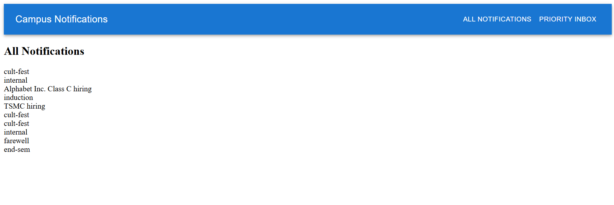
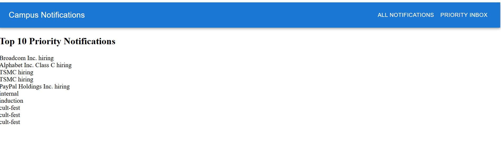
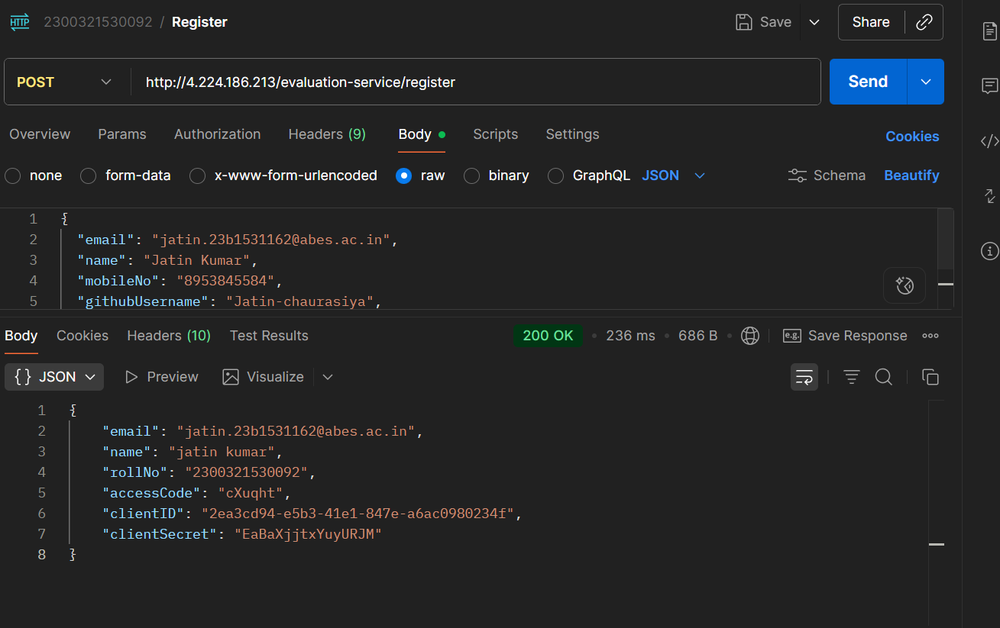
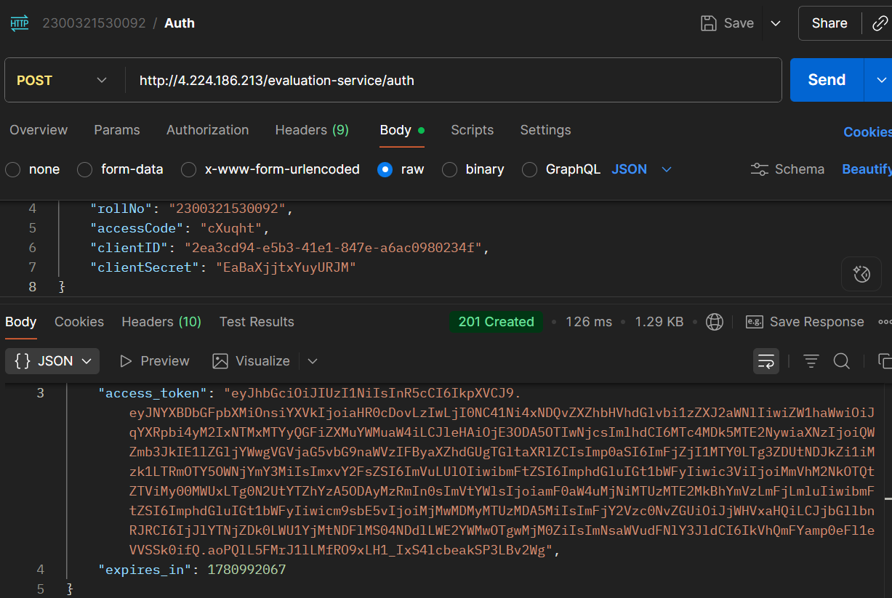

# Campus Notification System

A notification management system that fetches, prioritizes, and displays campus notifications based on predefined priority rules.

## Project Structure

```text
logging_middleware/
notification_app_be/
notification_app_fe/
notification_system_design.md
```

## Features

* Fetch notifications from the provided API
* Priority-based notification sorting
* Recent notifications displayed first
* React-based frontend
* Logging middleware integration
* Material UI components

## Priority Rules

Notifications are prioritized in the following order:

```text
Placement > Result > Event
```

For notifications of the same type, the most recent notification is displayed first.

## Tech Stack

* React.js
* JavaScript
* Material UI
* Vite
* REST APIs

## Screenshots

### Application UI





### PostMan
## Register

## Auth 


## Setup

```bash
git clone <repository-url>

cd notification_app_fe

npm install

npm run dev
```
